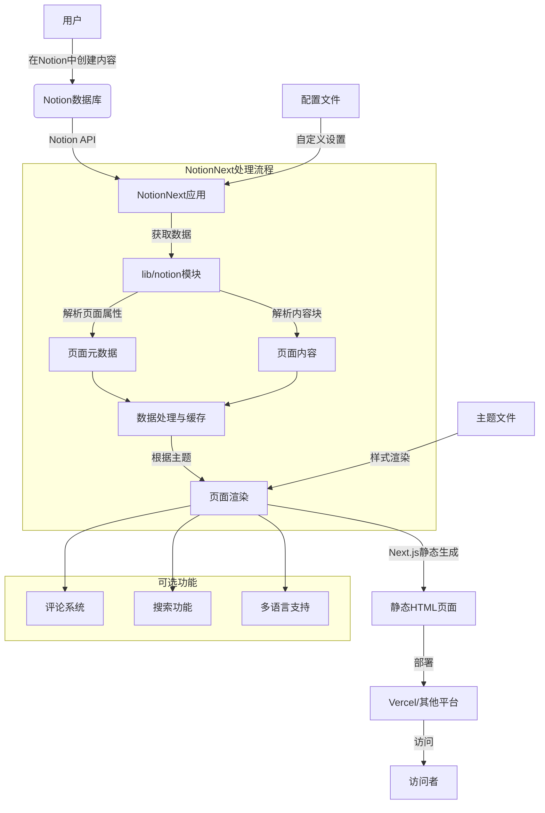

# NotionNext项目总结

## 项目概述

NotionNext是一个使用Next.js和Notion API实现的静态博客系统，可部署在Vercel上。它允许用户使用Notion作为内容管理系统，轻松创建和管理个人博客。

## 技术栈

- **框架**: [Next.js](https://nextjs.org)
- **样式**: [Tailwind CSS](https://www.tailwindcss.cn/)
- **渲染**: [React-notion-x](https://github.com/NotionX/react-notion-x)
- **评论系统**: Twikoo, Giscus, Gitalk, Cusdis, Utterances
- **图标**: Fontawesome

## 项目结构

```
NotionNext/
├── .git/                  # Git版本控制
├── .github/               # GitHub相关配置
├── .vscode/               # VS Code配置
├── components/            # React组件
├── conf/                  # 配置文件目录
├── docs/                  # 文档
├── hooks/                 # React Hooks
├── lib/                   # 核心库
│   ├── cache/             # 缓存相关
│   ├── db/                # 数据库相关
│   ├── lang/              # 多语言支持
│   ├── notion/            # Notion API相关
│   └── utils/             # 实用工具
├── pages/                 # Next.js页面
│   ├── api/               # API路由
│   ├── category/          # 分类页面
│   ├── tag/               # 标签页面
│   └── [prefix]/          # 动态路由
├── public/                # 静态资源
├── styles/                # 全局样式
└── themes/                # 主题
    ├── example/           # 示例主题
    ├── fukasawa/          # Fukasawa主题
    ├── gitbook/           # Gitbook主题
    ├── hexo/              # Hexo主题
    ├── matery/            # Matery主题
    ├── medium/            # Medium主题
    ├── next/              # Next主题
    ├── nobelium/          # Nobelium主题
    ├── simple/            # 简约主题
    └── ...                # 更多主题
```

## 核心功能

1. **Notion作为CMS**：使用Notion数据库存储和管理博客内容
2. **多主题支持**：内置20+个精美主题，可一键切换
3. **响应式设计**：支持各种设备屏幕
4. **多语言支持**：支持中文、英文等多种语言
5. **多种评论系统**：支持多种第三方评论插件
6. **SEO优化**：自动生成站点地图和RSS订阅
7. **图片优化**：支持图片懒加载和优化
8. **自定义功能**：支持自定义菜单、样式、外部脚本等

## 配置系统

项目使用`blog.config.js`作为主配置文件，并将更多复杂配置拆分到`/conf/`目录下：

- **评论插件**: `comment.config.js`
- **联系方式**: `contact.config.js`
- **文章配置**: `post.config.js`
- **访问统计**: `analytics.config.js`
- **图片配置**: `image.config.js`
- **字体配置**: `font.config.js`
- **代码块样式**: `code.config.js`
- **动效美化**: `animation.config.js`
- **挂件配置**: `widget.config.js`
- **广告插件**: `ad.config.js`
- **第三方插件**: `plugin.config.js`

## Notion集成

NotionNext通过`lib/notion`目录下的模块与Notion API进行交互：

- 获取页面属性和内容块
- 处理元数据和目录结构
- 处理图像和URL转换
- 获取分类和标签信息

## 部署方式

项目支持多种部署方案，主要部署在Vercel上，同时也支持Docker和其他静态网站托管服务。

## 项目流程图



## 扩展开发

1. 可以自定义主题：在`themes/`目录下创建新主题
2. 可以添加新功能：扩展`components/`和`lib/`中的模块
3. 可以自定义布局：通过`conf/layout-map.config.js`配置

## 许可证

项目采用MIT许可证。 