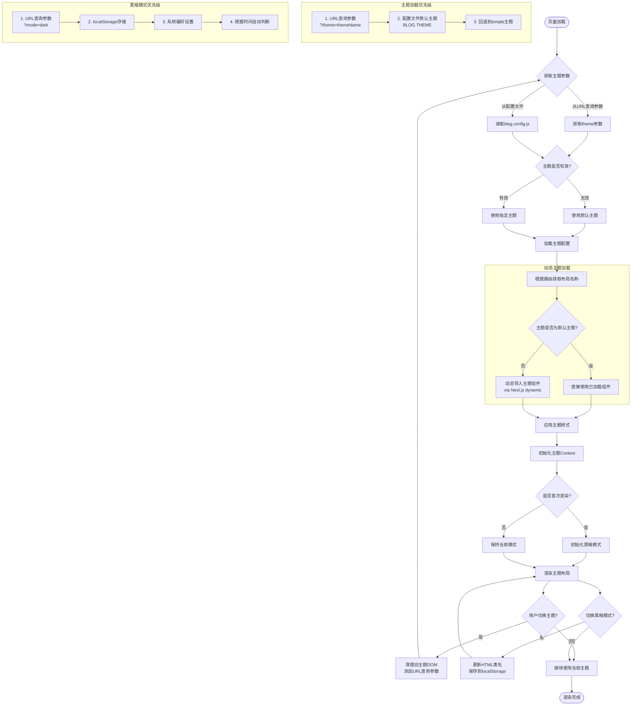

# NotionNext主题系统总结

## 概述

NotionNext提供了丰富多样的主题系统，使用户能够根据个人喜好和需求自定义博客外观。主题系统采用模块化设计，便于切换和定制。

## 可用主题列表

NotionNext目前提供了以下主题:

- **starter**: 基础起始主题
- **starter_chiya**: 基于starter的衍生主题
- **simple**: 简约风格主题
- **next**: 类似Next.js官网风格的主题
- **medium**: 类似Medium网站风格的主题
- **hexo**: 类似Hexo博客的主题
- **nobelium**: 简洁现代的主题
- **fukasawa**: 格子式布局主题
- **gitbook**: 类似电子书文档风格主题
- **matery**: 多彩卡片式主题
- **heo**: 彩色风格主题
- **example**: 示例主题，适合作为开发新主题的模板
- **plog**: 图片博客风格主题
- **photo**: 摄影作品展示主题
- **movie**: 电影博客主题
- **nav**: 导航页面主题
- **magzine**: 杂志风格主题
- **landing**: 落地页风格主题
- **game**: 游戏相关主题
- **commerce**: 电商风格主题

## 主题结构

每个主题通常由以下文件组成:

```
themes/[主题名称]/
├── components/           # 主题特定组件
├── index.js              # 主题主文件，导出布局和组件
├── style.js              # 主题样式定义
└── config.js             # 主题配置选项
```

## 主题系统核心机制

NotionNext主题系统的核心实现在`themes/theme.js`文件中，提供了以下关键功能:

1. **主题切换**: 支持通过URL参数或配置文件切换主题
2. **动态加载**: 按需加载主题组件，提高性能
3. **布局映射**: 根据不同路径应用相应的布局
4. **黑暗模式**: 支持明暗模式切换，可根据系统设置、时间或用户偏好自动调整

## 共同技术特性

1. **React Context全局状态**：每个主题都定义了自己的Context用于主题内部状态管理
2. **动态组件加载**：使用Next.js的dynamic import功能实现组件按需加载
3. **可配置性**：每个主题都提供了一个config.js文件进行主题特定配置
4. **响应式设计**：使用Tailwind CSS实现响应式布局
5. **黑暗模式**：集成了暗色模式支持
6. **布局系统**：提供了多种适应不同页面类型的布局组件
7. **主题样式隔离**：每个主题都有一个唯一的ID（如`theme-next`、`theme-hexo`）以避免样式冲突

## 主题配置参数

每个主题都有自己的配置文件(config.js)，允许用户自定义主题的特定功能。以simple主题为例:

- 顶栏显示控制
- Logo和描述设置
- 文章列表广告控制
- 文章封面显示控制
- 推荐文章显示控制
- 菜单项显示控制

## 主题样式定义

主题样式通过style.js文件定义，主要包括:

- 颜色方案
- 字体设置
- 间距和边距
- 特殊效果样式

## 自定义主题开发

开发者可以通过以下步骤创建新主题:

1. 在themes目录下创建新主题文件夹
2. 参考example主题的结构复制必要的文件
3. 修改index.js定义主要布局和组件
4. 创建自定义样式和配置文件
5. 在组件目录中添加或修改特定组件

## 主题切换机制

用户可以通过以下方式切换主题:

1. 在URL中添加`?theme=主题名称`参数
2. 在blog.config.js中设置默认主题
3. 通过主题切换组件在页面中切换

## 黑暗模式支持

大多数主题支持黑暗模式，实现方式包括:

- 自动根据系统偏好设置切换
- 根据时间自动切换(例如晚上自动切换到黑暗模式)
- 通过用户手动切换并保存到localStorage

## 响应式设计

所有主题都采用响应式设计，能够自适应不同屏幕大小:

- 移动设备优化
- 平板电脑兼容
- 桌面端完整体验

## 技术实现方式

1. **模块化组件设计**：
   - 每个主题将UI拆分为独立、可复用的组件
   - 组件间通过props和context进行通信
   - 采用自顶向下的数据流模式

2. **动态主题加载**：
   ```javascript
   return dynamic(
     () => import(`@/themes/${themeQuery}`).then(m => loadThemeComponents(m)),
     { ssr: true }
   )
   ```

3. **布局系统**：
   - 定义了多种通用布局（LayoutBase、LayoutIndex、LayoutArchive等）
   - 通过布局映射将URL路径映射到特定布局
   - 支持布局嵌套和插槽（slot）机制

4. **主题切换处理**：
   ```javascript
   // 修复DOM中的主题元素
   const fixThemeDOM = () => {
     if (isBrowser) {
       const elements = document.querySelectorAll('[id^="theme-"]')
       if (elements?.length > 1) {
         // 清理多余的主题DOM元素
       }
     }
   }
   ```

5. **黑暗模式实现**：
   ```javascript
   // 初始化深色模式，优先级：查询参数 > 本地存储 > 系统偏好
   export const initDarkMode = (updateDarkMode, defaultDarkMode) => {
     // 检查系统偏好
     let newDarkMode = isPreferDark()
     // 检查本地存储
     const userDarkMode = loadDarkModeFromLocalStorage()
     // 检查URL参数
     const queryMode = getQueryVariable('mode')
     // 应用深色模式
     document
       .getElementsByTagName('html')[0]
       .setAttribute('class', newDarkMode ? 'dark' : 'light')
   }
   ``` 

## 主题调用机制流程图


## 不同主题的技术特点分析

### Next主题

Next主题是一个模仿Next.js官方网站风格的主题，具有以下技术特点：

1. **布局结构**：采用左中右三栏布局，移动端自动切换为顶部导航栏布局
2. **全局状态管理**：使用React Context API（ThemeGlobalNext）管理主题内部状态
3. **滚动监听**：实现了页面滚动监听功能，可以显示阅读进度百分比
4. **悬浮组件**：右下角有一组悬浮按钮，包括返回顶部、跳转到底部和切换暗黑模式
5. **TOC抽屉**：在移动端使用抽屉组件展示文章目录
6. **自适应侧边栏**：支持通过配置反转侧边栏的位置（左变右，右变左）
7. **Facebook Messenger兼容**：特别处理了和Facebook Messenger插件的位置冲突问题

### Gitbook主题

Gitbook主题模仿了电子书/文档网站的风格，技术特点包括：

1. **文档导航**：左侧提供类似文档网站的导航系统
2. **最新内容标记**：智能标记最新文章，使用localStorage记录用户阅读状态
3. **三栏布局**：左侧导航、中间内容、右侧目录的三栏布局
4. **抽屉组件**：在移动端使用抽屉组件展示导航和目录
5. **全宽模式**：支持通过全局状态切换全宽显示模式
6. **客户端路由处理**：专门处理了客户端路由重定向和权限验证

### Hexo主题

Hexo主题模仿了流行的静态博客生成器Hexo的风格，技术特点包括：

1. **动画过渡效果**：使用Headless UI的Transition组件实现页面加载动画
2. **Hero组件**：首页可选的大型Hero组件
3. **两栏布局**：采用内容和侧边栏的两栏布局
4. **文章相关功能**：包括相邻文章导航、版权声明、推荐阅读等功能
5. **随机文章按钮**：可配置的随机跳转到博客文章功能
6. **列表样式切换**：支持分页式和无限滚动两种文章列表样式

### Matery主题

Matery主题采用了多彩卡片式设计，技术特点包括：

1. **WOW.js动画**：集成了WOW.js实现滚动触发动画效果
2. **卡片式布局**：使用卡片组件展示文章和信息
3. **可配置Banner**：可选的首页大型横幅
4. **浮动组件**：左下角和右下角的浮动组件区域
5. **Live2D集成**：左下角集成了Live2D动画角色
6. **搜索结果高亮**：在搜索页面自动高亮搜索关键词