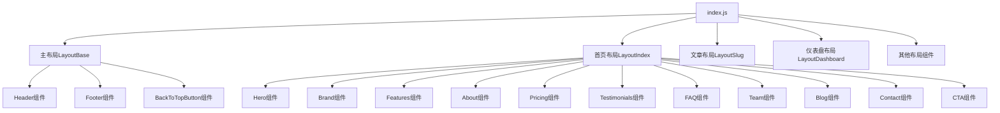

# Starter_Chiya主题分析与定制指南

## 最佳实践

1. **保持配置集中管理**：使用环境变量或配置文件统一管理设置
2. **组件模块化**：每个组件专注于单一功能
3. **使用CSS变量**：便于主题切换和样式复用
4. **遵循Tailwind设计理念**：优先使用工具类，减少自定义CSS
5. **适当添加动画**：使用WOW.js让页面更生动，但不要过度

## 开发注意事项

1. 主题使用了`#theme-starter`作为根选择器，自定义样式应遵循此规则
2. 主题依赖WOW.js实现动画效果，需确保正确加载
3. 暗黑模式通过`dark:`前缀类和`:is(.dark #theme-starter)`选择器实现
4. 使用`siteConfig()`函数动态获取配置，支持默认值 
## 性能优化技巧

1. **图片优化**：
   - 使用WebP格式图片
   - 使用`<LazyImage>`组件实现懒加载
   - 为大图设置合适的尺寸和压缩率

2. **组件按需加载**：
   - 利用条件渲染仅加载需要的组件
   - 使用`useEffect`在客户端加载复杂功能

3. **减少不必要的重渲染**：
   - 使用`React.memo`包装纯组件
   - 优化状态更新逻辑

## 主题概述

Starter_Chiya是NotionNext中一个精心设计的落地页(Landing Page)主题，主要用于产品展示、公司介绍或SaaS应用推广。它提供了丰富的可配置模块，现代化的UI设计和完整的响应式布局，适合需要专业展示产品或服务的用户。

## 技术架构



## 目录结构

```
themes/starter_chiya/
├── components/             # 主题组件
│   ├── svg/                # SVG图标组件
│   ├── About.js            # 关于部分组件
│   ├── ArticleLock.js      # 文章锁定组件
│   ├── BackToTopButton.js  # 返回顶部按钮
│   ├── Banner.js           # 横幅组件
│   ├── Blog.js             # 博客部分组件
│   ├── Brand.js            # 品牌展示组件
│   ├── Contact.js          # 联系我们组件
│   ├── CTA.js              # 号召行动组件
│   ├── DarkModeButton.js   # 暗黑模式切换按钮
│   ├── FAQ.js              # 常见问题组件
│   ├── Features.js         # 特性展示组件
│   ├── Footer.js           # 页脚组件
│   ├── Header.js           # 页头组件
│   ├── Hero.js             # 英雄区组件
│   ├── Logo.js             # Logo组件
│   ├── MadeWithButton.js   # 制作信息按钮
│   ├── MenuList.js         # 菜单列表组件
│   ├── MenuItem.js         # 菜单项组件
│   ├── MessageForm.js      # 消息表单组件
│   ├── Pricing.js          # 价格展示组件
│   ├── SearchInput.js      # 搜索输入框组件
│   ├── SignInForm.js       # 登录表单组件
│   ├── SignUpForm.js       # 注册表单组件
│   ├── SocialButton.js     # 社交媒体按钮组件
│   ├── Team.js             # 团队展示组件
│   └── Testimonials.js     # 用户评价组件
├── index.js                # 主题入口文件，定义布局组件
├── config.js               # 主题配置文件
└── style.js                # 主题样式定义文件
```

## 主要特点

1. **模块化设计**：主题由多个独立模块组成，可根据需要启用或禁用
2. **高度可配置**：几乎所有UI元素和内容都可通过配置文件自定义
3. **响应式布局**：完美适配桌面、平板和移动设备
4. **暗黑模式支持**：内置暗黑模式切换功能
5. **动画效果**：集成WOW.js实现精美的滚动动画效果
6. **完整的落地页元素**：包含产品介绍、特性展示、价格表、团队介绍等营销必备元素
7. **博客展示**：首页集成博客文章列表展示
8. **用户认证支持**：集成了登录和注册表单

## 配置系统详解

Starter_Chiya主题使用了全面的配置系统，主要通过`config.js`文件进行控制：

1. **品牌相关配置**：
   - `STARTER_LOGO`：普通logo图片路径
   - `STARTER_LOGO_WHITE`：透明底浅色logo路径

2. **英雄区配置**：
   - `STARTER_HERO_ENABLE`：开启/关闭英雄区
   - `STARTER_HERO_TITLE_1`和`STARTER_HERO_TITLE_2`：主副标题
   - `STARTER_HERO_BUTTON_1_TEXT`和`STARTER_HERO_BUTTON_2_TEXT`：按钮文字
   - `STARTER_HERO_PREVIEW_IMAGE`：产品预览图
   - `STARTER_HERO_BANNER_IMAGE`：hero区下方的全宽图

3. **功能区块控制开关**：
   - `STARTER_FEATURE_ENABLE`：特性区块开关
   - `STARTER_ABOUT_ENABLE`：关于区块开关
   - `STARTER_PRICING_ENABLE`：价格区块开关
   - `STARTER_TESTIMONIALS_ENABLE`：用户评价区块开关
   - `STARTER_FAQ_ENABLE`：常见问题区块开关
   - `STARTER_TEAM_ENABLE`：团队介绍区块开关
   - `STARTER_BLOG_ENABLE`：博客区块开关
   - `STARTER_CONTACT_ENABLE`：联系方式区块开关
   - `STARTER_CTA_ENABLE`：号召行动区块开关

4. **内容配置**：
   - 每个区块都有对应的标题、描述和按钮文本配置
   - 价格表可配置不同套餐的价格、功能和链接
   - 用户评价可配置多位用户的头像、姓名和评价内容

## 核心组件分析

### 1. Hero组件

英雄区是落地页的第一屏，包含主标题、副标题、行动按钮和产品预览图。代码特点：

```jsx
<div id='home' className='relative overflow-hidden bg-primary pt-[120px] md:pt-[130px] lg:pt-[160px]'>
  {/* 内容区 */}
  <div className='container'>
    <div className='-mx-4 flex flex-wrap items-center'>
      {/* 标题区 */}
      <div className='w-full px-4'>
        <div className='hero-content wow fadeInUp mx-auto max-w-[780px] text-center' data-wow-delay='.2s'>
          {/* 动态获取配置的主标题、副标题和按钮 */}
        </div>
      </div>
      
      {/* 产品预览图片 - 条件渲染 */}
      {siteConfig('STARTER_HERO_PREVIEW_IMAGE', null, config) && (
        <div className='w-full px-4'>
          {/* 图片和装饰元素 */}
        </div>
      )}
    </div>
  </div>
</div>
```

### 2. Header组件

顶部导航栏，处理菜单展示、暗黑模式切换和响应式布局：

- 使用`useState`管理菜单展开状态和滚动状态
- 支持通过`siteConfig`动态获取配置
- 集成了暗黑模式切换按钮
- 使用`MenuList`组件渲染菜单项

### 3. Features组件

产品特性展示区，使用网格布局展示产品主要功能点：

- 使用TailwindCSS的网格系统创建响应式布局
- 支持图标、标题和描述的组合展示
- 每个特性卡片都使用WOW.js添加了动画效果

## 样式系统

Starter_Chiya主题使用了组合式的样式方案：

1. **TailwindCSS**：大部分样式通过Tailwind类名直接应用
2. **全局样式**：在`style.js`中定义了一些全局样式规则
3. **CSS变量**：使用CSS变量定义主题颜色，支持暗黑模式切换

样式特点：

```jsx
// style.js中定义了一些特定的样式规则
<style jsx global>{`
  #theme-starter .sticky{
    position: fixed;
    z-index: 20;
    background-color: rgb(255 255 255 / 0.8);
    transition-property: color, background-color, border-color, text-decoration-color, fill, stroke, opacity, box-shadow, transform, filter, -webkit-backdrop-filter;
    transition-property: color, background-color, border-color, text-decoration-color, fill, stroke, opacity, box-shadow, transform, filter, backdrop-filter;
    transition-property: color, background-color, border-color, text-decoration-color, fill, stroke, opacity, box-shadow, transform, filter, backdrop-filter, -webkit-backdrop-filter;
    transition-timing-function: cubic-bezier(0.4, 0, 0.2, 1);
    transition-duration: 150ms;
  }
  
  :is(.dark #theme-starter .sticky){
    background-color: rgb(17 25 40 / 0.8);
  }
  
  // 更多样式规则...
`}</style>
```

## 布局系统

主题使用了灵活的布局系统，包含以下关键布局：

1. **LayoutBase**：基础布局，包含页头、页脚和主内容区
2. **LayoutIndex**：首页布局，根据配置条件渲染各个模块
3. **LayoutSlug**：文章详情页布局，支持文章锁定功能
4. **LayoutDashboard**：仪表盘布局
5. **其他专用布局**：如404页面、搜索页面等

## 定制指南

### 1. 基本配置修改

修改`blog.config.js`和环境变量中的配置：

```javascript
NEXT_PUBLIC_THEME=starter_chiya // 设置主题
```

### 2. 模块启用/禁用

在`blog.config.js`或环境变量中设置各模块的启用状态：

```javascript
NEXT_PUBLIC_THEME_STARTER_HERO_ENABLE=true // 启用英雄区
NEXT_PUBLIC_THEME_STARTER_FEATURE_ENABLE=true // 启用特性区块
// 其他模块开关...
```

### 3. 内容定制

1. 通过环境变量修改文本内容：
   ```javascript
   NEXT_PUBLIC_THEME_STARTER_HERO_TITLE_1="你的主标题"
   NEXT_PUBLIC_THEME_STARTER_HERO_TITLE_2="你的副标题"
   ```

2. 通过配置文件修改图片路径：
   ```javascript
   STARTER_HERO_PREVIEW_IMAGE: '/your-image-path.jpg'
   ```

### 4. 组件定制

1. **修改现有组件**：复制原组件到项目根目录，按需修改后在`blog.config.js`中指定路径

2. **添加新组件**：
   ```jsx
   // 创建新组件
   export const NewComponent = () => {
     return <div>新组件内容</div>
   }
   
   // 在index.js中添加到适当的布局中
   {siteConfig('YOUR_NEW_COMPONENT_ENABLE', false) && <NewComponent />}
   ```

3. **修改样式**：
   ```jsx
   // 在style.js中添加新样式
   <style jsx global>{`
     #theme-starter .your-new-class {
       // 你的样式
     }
   `}</style>
   ```

## 常见问题解答

1. **如何更换Logo？**
   - 将Logo图片放入public目录，在配置中指定路径：`STARTER_LOGO: '/your-logo.png'`

2. **如何修改颜色方案？**
   - 在项目根目录的`tailwind.config.js`中修改颜色变量

3. **如何添加新的页面内容？**
   - 在Notion中创建新页面，并使用适当的模板处理

4. **如何自定义菜单？**
   - 通过Notion后台添加MENU类型的页面即可
